## Introduction

Nous avons choisi d'exécuter les composantes de cette application avec Docker, car cela simplifie le processus de gestion des processus d'application.

Voici un diagramme de déploiement expliquant la relation des composantes et comment les images Docker sont créées et déployées dans un serveur.

```puml
    @startuml
    [Navigateur moderne (Windows/Android)] as Navigateur
    [MongoDB] as MongoDB
    Navigateur -> "docker-compose.yml"
    [Docker] as Docker
    "docker-compose.yml" -> [evaluetonSavoir-backend (Express, Javscript)]
    [evaluetonSavoir-backend (Express, Javscript)] -> API_REST
    [evaluetonSavoir-backend (Express, Javscript)] -> SOCKET_SALLE
    [evaluetonSavoir-routeur (nginx)] as routeur
    API_REST -> routeur
    SOCKET_SALLE -> routeur
    [evaluetonSavoir-frontend (Vue + TypeScript React)] as frontend
    routeur -> frontend
    [Docker hub] as DockerHub
    [image-evaluetonSavoir-backend] -> DockerHub
    [image-evaluetonSavoir-routeur] -> DockerHub
    [image-evaluetonSavoir-frontend] -> DockerHub
    [GitHub] as GitHub
    "backend-deploy.yml" <- GitHub
    "routeur-deploy.yml" <- GitHub
    "frontend-deploy.yml" <- GitHub
    Navigateur <--> evalsa.etsmtl.ca : chargée à partir des pages web
    @enduml
```



## Prérequis

Les STI nous a fourni un serveur avec les spécifications suivantes :

- Ubuntu 22.04 LTS
- CPU : 4 cœurs
- RAM : 8 Go
- HDD : 100 Go
- Certificat SSL

Les STI ont déjà effectué la configuration initiale de la machine selon leurs normes de mise en place d'un serveur pour assurer la bonne maintenance et sécurité au sein de leur infrastructure. Cette configuration inclut un utilisateur non root.

Vous aurez également besoin d'un compte Docker Hub, ou vous pouvez simplement créer une PR sur le projet principal et elle sera déployée automatiquement.

## Étape 1 - Installation de Docker

Connectez-vous avec les informations d'identification de l'ETS :
```
ssh <email>@<IP>
```

Tout d'abord, mettez à jour votre liste existante de packages :
```
sudo apt update
```

Ensuite, installez quelques packages prérequis qui permettent à apt d'utiliser des packages via HTTPS :
> [!WARNING]
> Si vous voyez l'erreur suivante, ARRÊTEZ. Contactez les STI pour résoudre le problème. \
> `Waiting for cache lock: Could not get lock /var/lib/dpkg/lock-frontend. It is held by process 10703 (apt)`
```
sudo apt install apt-transport-https ca-certificates curl software-properties-common
```

Ajoutez la clé GPG du référentiel Docker officiel à votre système :
```
curl -fsSL https://download.docker.com/linux/ubuntu/gpg | sudo gpg --dearmor -o /usr/share/keyrings/docker-archive-keyring.gpg
```

Ajoutez le référentiel Docker aux sources APT :
```
echo "deb [arch=$(dpkg --print-architecture) signed-by=/usr/share/keyrings/docker-archive-keyring.gpg] https://download.docker.com/linux/ubuntu $(lsb_release -cs) stable" | sudo tee /etc/apt/sources.list.d/docker.list > /dev/null
```

Mettez à jour à nouveau votre liste existante de packages pour que l'ajout soit reconnu :
```
sudo apt update
```

Assurez-vous que vous vous apprêtez à installer à partir du référentiel Docker plutôt que du référentiel Ubuntu par défaut :
```
apt-cache policy docker-ce
```

Vous verrez une sortie comme celle-ci, bien que le numéro de version pour Docker puisse être différent :
```Output
docker-ce:
  Installed: (none)
  Candidate: 5:26.0.0-1~ubuntu.22.04~jammy
  Version table:
     5:26.0.0-1~ubuntu.22.04~jammy 500
        500 https://download.docker.com/linux/ubuntu jammy/stable amd64 Packages
     5:25.0.5-1~ubuntu.22.04~jammy 500
        500 https://download.docker.com/linux/ubuntu jammy/stable amd64 Packages
...
```

Installez Docker :
```
sudo apt install docker-ce
```

Vérifiez que Docker fonctionne :
```
sudo systemctl status docker
```

La sortie devrait être similaire à ce qui suit, montrant que le service est actif et en cours d'exécution :
```Output
● docker.service - Docker Application Container Engine
     Loaded: loaded (/lib/systemd/system/docker.service; enabled; vendor preset: enabled)
     Active: active (running) since Fri 2024-04-05 13:20:12 EDT; 1min 24s ago
TriggeredBy: ● docker.socket
       Docs: https://docs.docker.com
   Main PID: 19389 (dockerd)
      Tasks: 10
     Memory: 28.7M
        CPU: 172ms
     CGroup: /system.slice/docker.service
             └─19389 /usr/bin/dockerd -H fd:// --containerd=/run/containerd/containerd.sock
...
```

> [!NOTE]
> Si Docker ne roule pas, p.ex. vous voyez :
> ```
> ○ docker.service - Docker Application Container Engine
>      Loaded: loaded (/lib/systemd/system/docker.service; enabled; vendor preset: enabled)
>      Active: inactive (dead)
> ```
> Vous devez démarrer Docker :
> ```
> sudo systemctl start docker
> ```

## Étape 2 - Installation de Docker Compose

Créez un répertoire d'installation Docker Compose :
```
mkdir -p ~/.docker/cli-plugins/
```

Obtenez Docker Compose :
```
curl -SL https://github.com/docker/compose/releases/download/v2.26.1/docker-compose-linux-x86_64 -o ~/.docker/cli-plugins/docker-compose
```

Ensuite, définissez les permissions correctes pour que la commande docker compose soit exécutable :
```
chmod +x ~/.docker/cli-plugins/docker-compose
```

Pour vérifier que l'installation a réussi, vous pouvez exécuter :
```
docker compose version
```


## Étape 3 - Ajouter notre projet


Commencez par créer un nouveau répertoire dans votre dossier personnel :
```
mkdir ~/EvalueTonSavoir
```

Puis déplacez-vous dans le répertoire :
```
cd ~/EvalueTonSavoir
```

Créez un fichier `docker-compose.yaml` à partir du dépôt GitHub :
```
curl -SL https://raw.githubusercontent.com/ets-cfuhrman-pfe/EvalueTonSavoir/main/docker-compose.yaml -o docker-compose.yaml
```

> [!NOTE]
> Avant de continuer, veuillez noter qu'il est crucial de mettre à jour les variables d'environnement dans le script, car les valeurs actuelles sont des modèles génériques. Assurez-vous de personnaliser ces variables selon les besoins spécifiques de votre environnement avant d'exécuter le script.

Avec le fichier docker-compose.yml en place, vous pouvez maintenant exécuter Docker Compose pour démarrer votre environnement :
```
sudo docker compose up -d
```

Vérifiez que les services fonctionne :
```
sudo docker ps -a
```

## Conclusion

Félicitations ! Vous avez maintenant avec succès configuré et lancé EvalueTonSavoir sur votre serveur, prêt à être utilisé. 
